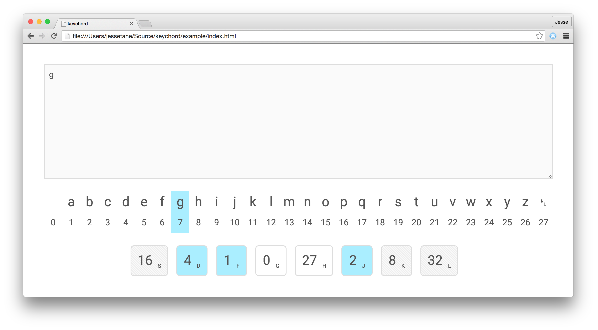

# keychord
A flexible chording keyboard in JavaScript.



## Why
The stenotype system is pretty rad, but is not suitable for generic input since chords map to entire words instead of individual characters. It also requires a true n-key-rollover keyboard, which most us unfortunately do not have. I am not sure whether chording individual letters can be faster than QWERTY or not, but this tool should make it easy to fool around.

## How
```javascript
var keychord = require('keychord')

var el = document.querySelector('textarea')

var alphabet = ' abcdefghijklmnopqrstuvwxyz\n'.split('')

var keyCodeToValueMap = {
  '83': 16,  // s
  '68': 4,   // d
  '70': 1,   // f
  '71': 0,   // g
  '72': 27,  // h
  '74': 2,   // j
  '75': 8,   // k
  '76': 32   // l
}

keychord(el, keyCodeToValueMap, onchord, onchange)

// fires when a chord was entered
function onchord (evt) {
  el.textContent += alphabet[evt.chord]
}

// fires any time the chord changes. optional but
// useful for updating user interface elements
function onchange (evt) {
  console.log('chord changed', evt.chord)
})
```

## Example
```bash
$ npm run example
$ open example/index.html
```

## License
WTFPL
